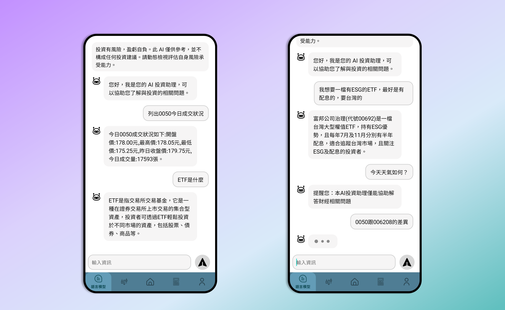
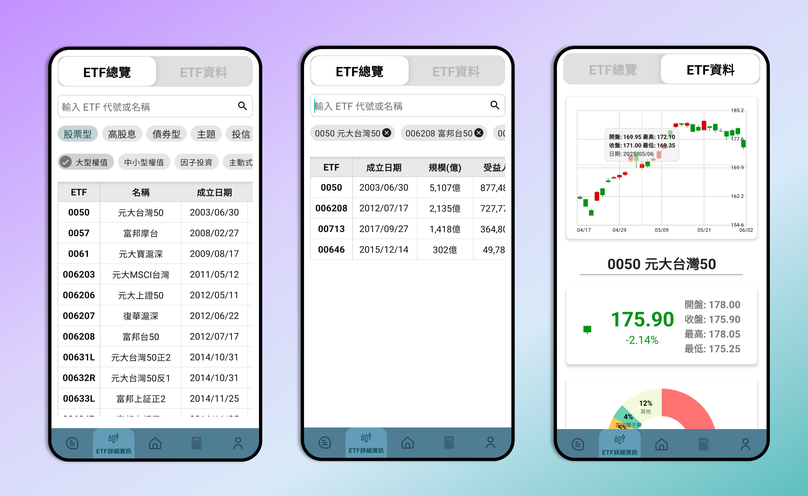
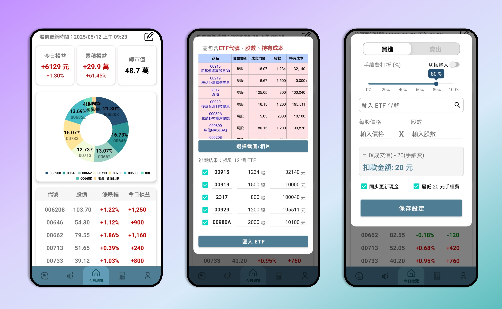
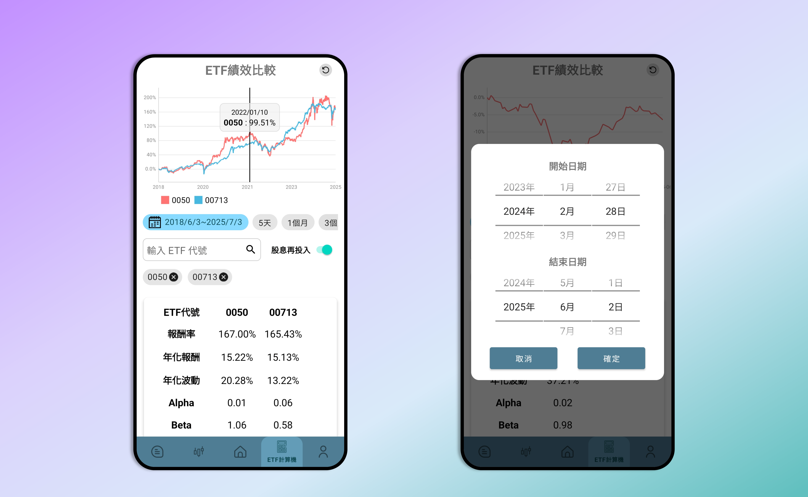
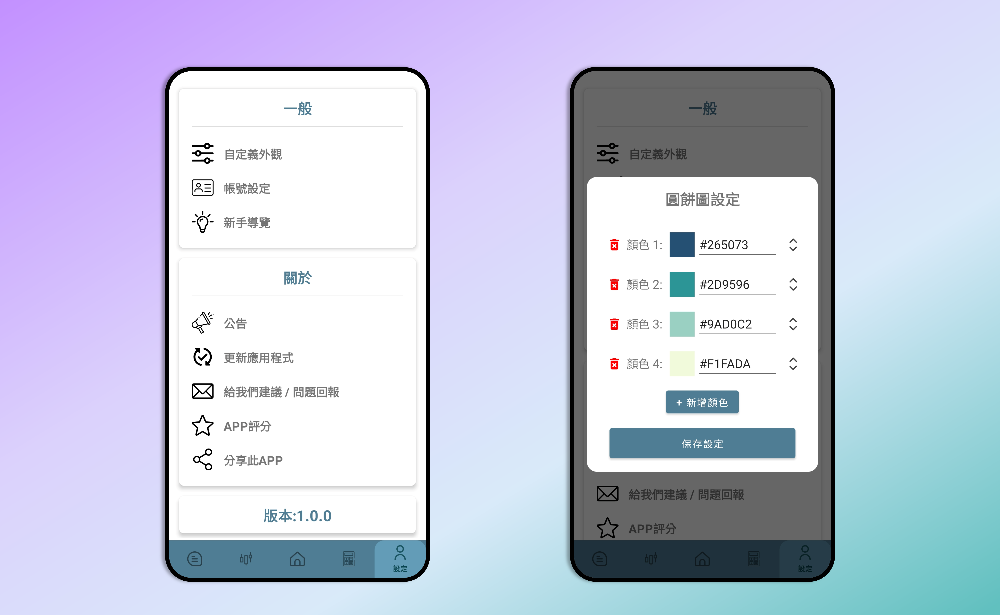

# ETFApp

### 一款結合語言模型與多功能的 ETF 投資 Android APP

<!-- Release badges 
-->

<a href="https://github.com/twl-Benchen/etfapp-download/releases">
  

 

<!-- 下載按鈕 -->
 
<a href="https://github.com/twl-Benchen/etfapp-download/releases/download/v0.9.1-beta/app-release.apk"
   style="text-decoration: none; font-size: 2em;">
  ▲ 點擊下載
</a>

---

## 📖 功能特色

* **語言模型對話**

  * 使用者透過對話查詢ETF相關內容，若輸入非財經問題，系統會提示。
  * 系統先用微調後的BERT判別，若屬於財經，再由微調後的LLaMA產生回覆。

* **ETF 詳細頁面**

  * 左側以標籤（如市值型、高股息等）篩選，點選主標籤可展開子標籤，亦可輸入代號或名稱搜尋。
  * 右側顯示所選ETF的K線圖（開盤、收盤、最高、最低）及前五大成分股與產業分布，點擊圓餅圖區塊可放大顯示數值。

* **今日總覽**

  * 顯示「今日損益」、「累積損益」、「總市值」，數值過大會自動顯示「萬」、「億」等單位，介面中有圓餅圖呈現資產配置。
  * 點右上角「編輯持股」可：

    1. **影像辨識**：上傳截圖自動擷取代號、股數、成本，若有誤可現場修改並選擇合併或取代。
    2. **快速編輯**：輸入ETF代號、成交價、股數，系統依設定手續費計算實際金額，並可同步更新現金。

* **ETF 計算機**

  * 最多同時比較10檔ETF，上方顯示歷史績效折線圖，可選5天、1個月、3個月、6個月、今年、1年、3年、5年或自訂日期，系統會自動校正時間順序。
  * 下方列出各檔ETF的報酬率、年化報酬率、年化波動度等指標，可選擇是否將股息再投入計算。

* **設定**

  * 可自訂圓餅圖、折線圖及K線圖的色系。
  * 「聯絡我們」按鈕連結至Google表單提交建議或問題；「更新應用程式」連結至GitHub；可利用分享機制將應用介紹與GitHub連結轉發。

---

## 📷 截圖預覽

  語言模型
   
  
  
    
  ETF 詳細頁面
   
  
  
    
  今日總覽
   
  
  
    
  ETF 計算機
   
  
  
    
  設定
   
  

---

## ⚙️ 安裝需求

- Android 8.0 (API level 26) 以上  
- 建議網路連線以取得即時 ETF 資料  

---

有任何問題或建議，歡迎在 Issues 提問或回饋 🙌  
