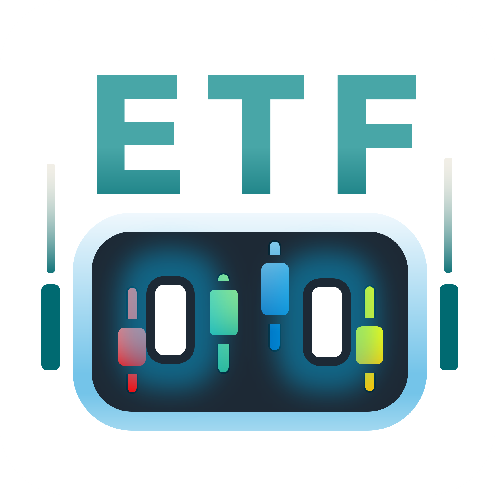

# ETFApp

### 一款結合語言模型與多功能的 ETF 投資 Android APP

<!-- Release badges 
-->

<a href="https://github.com/twl-Benchen/etfapp-download/releases">
  

 

<!-- 下載按鈕 -->

---

## 📖 功能特色

- **語言模型對話**：使用者可透過對話查詢 ETF 相關資料，非財經內容會得到提示  
- **ETF 詳細頁面**：  
  - 標籤式篩選 ETF，點擊主標籤後跳出子標籤  
  - 代號／名稱搜尋  
  - K 線圖 (開盤、收盤、最高、最低)  
  - 前五大產業類別與成分股瀏覽  
- **今日總攬**：  
  - 持股損益與配置一覽  
  - 點擊「今日損益」、「累積損益」、「總市值」可放大檢視完整金額  
  - 編輯持股：  
    1. 點右上編輯圖示進入編輯頁面  
    2. 圖像辨識匯入或修正持股資料  
    3. 快速編輯內建手續費計算  
- **ETF 計算機**：  
  - 選擇區間（或自訂日期）比較最多 10 檔 ETF  
  - 指標：報酬率、年化波動、Beta、最佳年度等  
  - 可選擇是否計算配息再投入  
- **設定**：  
  - 圓餅圖顯示持股比例  
  - 自訂漲／跌色、走勢圖色  
  - 回報連結至線上表單  

---

## 📷 截圖預覽

  <!-- 語言模型 -->
  

  <!-- ETF 詳細頁面 -->
  
  

  <!-- 今日總攬 -->
  
  
  
  

  <!-- ETF 計算機 -->
  
  

  <!-- 設定 -->
  
  

---

## ⚙️ 安裝需求

- Android 8.0 (API level 26) 以上  
- 建議網路連線以取得即時 ETF 資料  

---

有任何問題或建議，歡迎在 Issues 提問或回饋 🙌  
